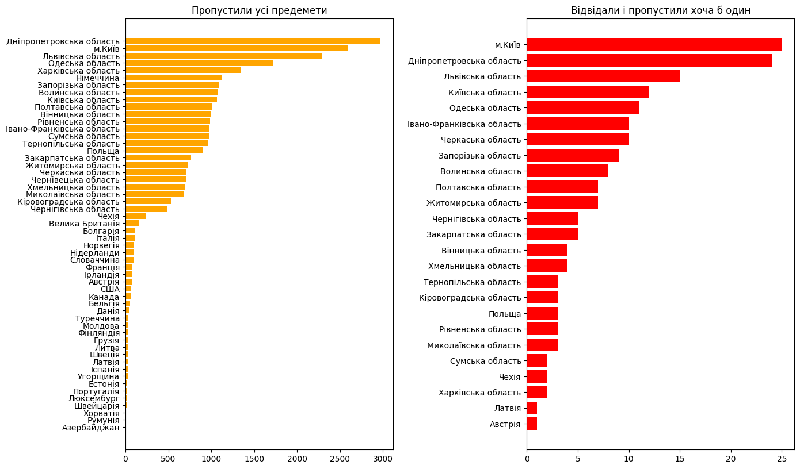
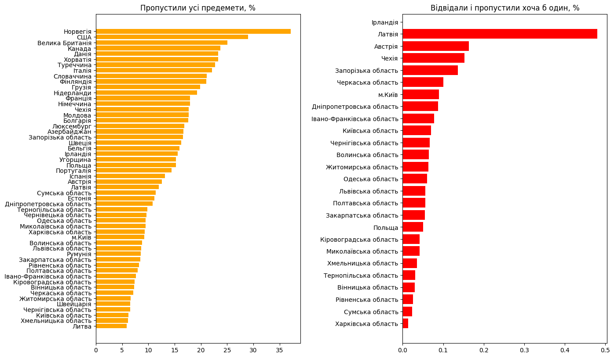
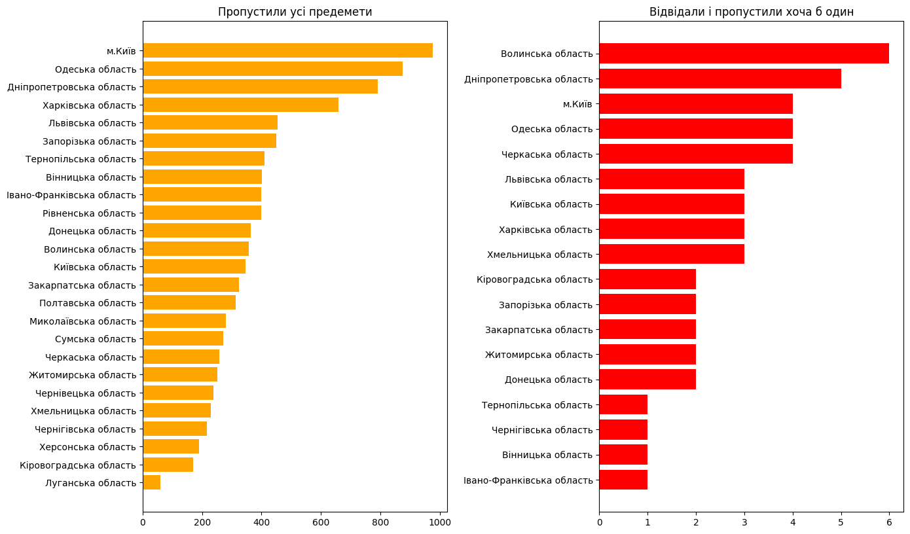
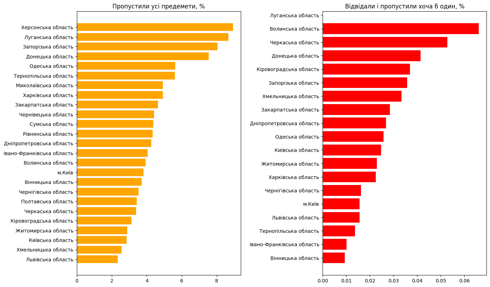

# Дослідження про учасників НМТ-2024, які пропустили тестування

## Учасники, які пропустили обов'язковий предмет

Пропоную розглянути кількості учасників, які не прийшли на всі предмети, та які брали участь, хоча б в одному тесті - вони не відвідали інші з якихось причин

#### Пропустили усі предемети

    29096

#### Відвідали і пропустили хоча б один

    179

### Розподіл за місцем тестування

    

#### Частки серед усіх учасників у цьому регіоні

    

    

#### Висновки

Таким чином, маючи аномалію щодо учасників НМТ, які пропустили усі предмети у інших країнах, ми можемо припустити гіпотезу, що учні не здають нмт через їх вступ до закордонних ВНЗ

### Розподіл за місцем навчання

    

    

#### Частки серед усіх учасників у цьому регіоні

    

    

#### Висновки

З данних випливає, що учасники з Луганської, Донецької, Запорізької, та Херсонької областей на понад 25% частіше повнісю пропускають участь в НМТ. Це може свідчити про фінансові, соціальні складнощі, та інші невідомі наразі проблеми, з якими вони стикаються, що вимушує їх пропустити участь в НМТ. Припускаю, що багато хто через бойові дії, та переселення не зміг підготуватися, та вирішив зовсім не брати участь. Або через відсутність планів на вищу освіту. Обидві гіпотези не втішають.
